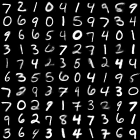

# VariationalAutoEncoder
Variational AutoEncoder

## Discription
- This is a tensorflow implementation for paper [Auto-Encoding Variational Bayes](https://arxiv.org/abs/1312.6114), the basic version come from [hwalsuklee/tensorflow-mnist-CVAE](https://github.com/hwalsuklee/tensorflow-mnist-CVAE)
- Experiment for different dimensions of z: 2,4,8,10,20,100
- High light results:
	- sampling manifold and mappings of train and test data(for mnist and dimension 2)
	- reconstruction results among all dimensions(that means a mapping from x to x_hat)
- Something interesting: plot sum loss, binary cross entropy loss(BCE) and kl-divergence(KLD). To my surprised, the results of BCE and KLD are logical, but the dim20 get the lowest sum loss, not the dim100.
	

## Result
### Manifold
Visualizations of data manifold. **Note**: in manifold.png the range of z is [-2,2]

### Features
The distribution of labeled data(including train and test).

	<table align='center'>
		<tr align='center'>
			<td> train mappings </td>
			<td> test mappings </td>
		</tr>
		<tr>
			<td>
			<td>
		</tr>
	</table>

### Loss & BCE & KLD

	<table align='center'>
		<tr align='center'>
			<td> Sum Loss </td>
			<td> BCE </td>
			<td> KLD </td>
		</tr>
		<tr>
			<td>
			<td>
			<td>
		</tr>
	</table>

### Reconstruction
Reconstruction for images. Dimension is a very import factor for reconstruction.

	<table align='center'>
		<tr align='center'>
			<td> 2-Dim latent space </td>
			<td> 4-Dim latent space </td>
			<td> 8-Dim latent space </td>
		</tr>
		<tr>
			<td>
			<td>
			<td>
		</tr>
		<tr align='center'>
			<td> 10-Dim latent space </td>
			<td> 20-Dim latent space </td>
			<td> 100-Dim latent space </td>
		</tr>
		<tr>
			<td>
			<td>
			<td>
		</tr>
	</table>

## Reference
The implementation is based on the projects: 
[1] https://github.com/hwalsuklee/tensorflow-mnist-VAE
[2] https://github.com/kvfrans/variational-autoencoder 